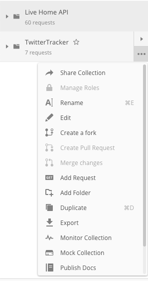
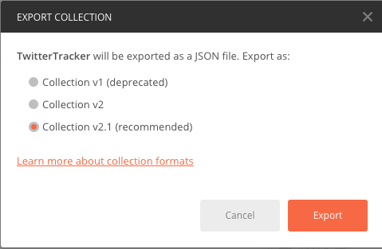

[](https://www.npmjs.com/postman-to-markdown)

# 📦  postman-to-markdown

This package generates a Markdown document from a Postman collection. Postman is
an API development environment that makes sending API requests very easy.

## Getting Started

👉 Before you begin: » Make sure you have downloaded [Postman][1] and installed
it on your computer. Alternatively, you can sign up to use the [web version][2]
of Postman.

-  First export the collection from Postman.





-  Save the collection file.

## Install

```npm
npm install -g postman-to-markdown
```

## Usage

Execute postman-to-markdown specifying the collection file.

```bash
postman-to-markdown postman_collection.json 
```

```
Reading file examples/postman_collection.json
Generating markdown file ...
Documentation was created correctly examples/postman_collection.md

```
The package will create an .md file.

Example of file generated
[postman_collection.md](examples/postman_collection.md)

## Contributing
If someone wants to add or improve something, I invite you to collaborate
directly in this repository: 
[postman-to-markdown](https://github.com/bautistaj/postman-to-markdown.git)

## License
postman-to-markdown is released under the
[MIT License](https://opensource.org/licenses/MIT).

[1]: https://www.postman.com/downloads/
[2]: https://www.postman.com/